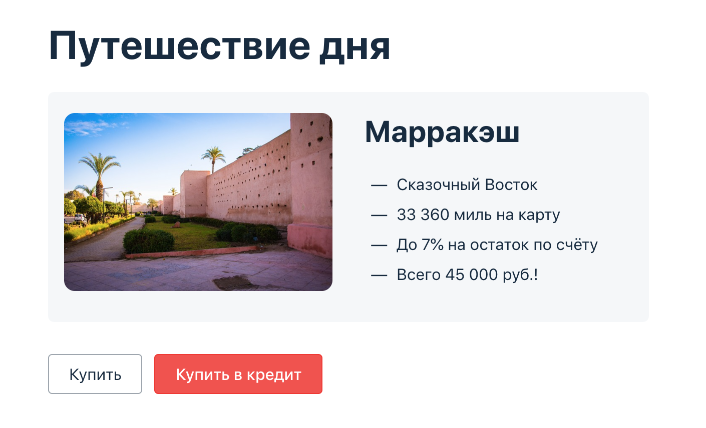

## Описание приложения

Приложение представляет из себя веб-сервис.

Приложение предлагает купить тур по определённой цене с помощью двух способов:

1. Обычная оплата по дебетовой карте
2. Уникальная технология: выдача кредита по данным банковской карты

## Документы:

- План автоматизации ([Plan.md](https://github.com/Ekaterina-Isabel/Diploma/blob/master/Plan.md))
- Отчёт о проведённом тестировании ([Report.md](https://github.com/Ekaterina-Isabel/Diploma/blob/master/Report.md))
- Отчёт о проведённой автоматизации ([Summary.md](https://github.com/Ekaterina-Isabel/Diploma/blob/master/Summary.md))

## Предустановленное ПО:

- Intellij idea Ultimate Edition
- Docker с предустановленным sql (https://hub.docker.com/_/mysql, https://hub.docker.com/_/postgres)

## Процедура запуска авто-тестов:

1. Запустить Docker
2. Для копирования репозитория в терминале выполнить команду `git clone <ссылка на репозиторий>`
3. Для запуска контейнеров с БД в терминале выполнить команду `docker-compose up`
4. Для запуска приложения в терминале выполнить команду `java -jar .\artifacts\aqa-shop.jar`. Приложение открывается на
   странице http://localhost:8080/
5. Для запуска симулятора банковских сервисов перейти в каталог `gate-simulator` и выполнить в терминале
   команду `npm start`
6. Запустить автотесты
